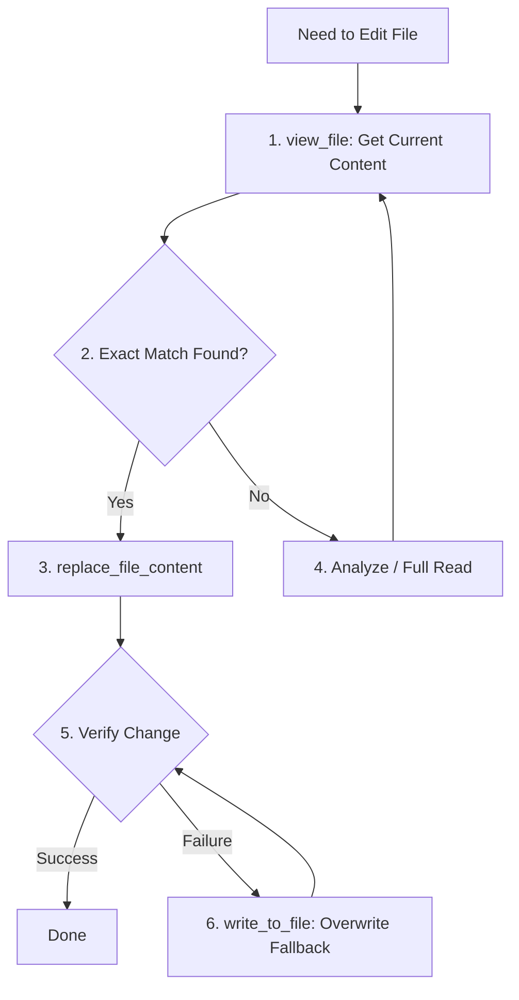

# Antigravity Tool Usage Guidelines

## File Editing Tools - Proper Usage

There are three main tools for editing files. Each has its place when used correctly.

---


## Robust File Editing Flow


## Tool Selection Guide

### `replace_file_content` - Preferred for Most Edits ✅

**Use this for single, contiguous block replacements. It's efficient and works well when used correctly.**

#### When to Use
- Replacing a function, class, or code block
- Updating a configuration section
- Fixing a specific piece of code
- Any single contiguous edit

#### Critical Requirements for Success

1. **Exact Character Matching**: `TargetContent` must match EXACTLY
   - Include ALL whitespace (spaces, tabs, newlines)
   - Match indentation precisely
   - Copy directly from `view_file` output

2. **View File First**: Always use `view_file` to see current content
   - Don't assume content from memory
   - Don't guess at whitespace
   - Copy the exact text you want to replace

3. **Single Contiguous Block**: One continuous section of text
   - From line X to line Y
   - No gaps in between

#### Proper Workflow

```
1. view_file to see exact current content
2. Copy EXACT text to replace (including all whitespace)
3. Use that as TargetContent
4. Provide ReplacementContent
5. Set StartLine and EndLine to contain the target
```

#### Example - Correct Usage

```javascript
// You viewed the file and saw:
//   Line 45:   const x = 1;
//   Line 46:   const y = 2;

TargetContent: "  const x = 1;\n  const y = 2;\n"  // Exact match
ReplacementContent: "  const x = 10;\n  const y = 20;\n"
StartLine: 45
EndLine: 46
```

---

### `write_to_file` - For Complete Rewrites

**Use when you need to rewrite the entire file or when multiple non-contiguous edits are needed.**

#### When to Use
- Multiple separate edits across the file
- File structure changes
- When you're not sure of exact whitespace
- Creating new files

#### Workflow

```
1. view_file to read entire content
2. Modify content in memory
3. write_to_file with Overwrite: true
4. Validate changes
```

---

### `multi_replace_file_content` - For Multiple Edits

**Use for multiple separate, non-contiguous edits in the same file.**

#### When to Use
- Need to change 2+ separate sections
- Each section is in a different part of the file
- More efficient than full rewrite for large files

#### Requirements
- Same exact matching rules as `replace_file_content`
- Each chunk needs its own TargetContent/ReplacementContent
- View file first to get exact content

---

## Decision Tree

```
Need to modify a file?
│
├─ Single contiguous section?
│  └─ Use replace_file_content ✅
│
├─ 2-5 separate sections?
│  └─ Use multi_replace_file_content
│
├─ Many changes throughout file?
│  └─ Use write_to_file
│
├─ Not sure of exact whitespace?
│  └─ Use write_to_file
│
└─ Creating new file?
   └─ Use write_to_file
```

---

## Common Mistakes to Avoid

### ❌ Don't Assume Content

```javascript
// WRONG - guessing at content
TargetContent: "const x = 1;"  // Missing indentation!

// RIGHT - copied from view_file
TargetContent: "  const x = 1;\n"  // Exact match
```

### ❌ Don't Skip view_file

```javascript
// WRONG
// Assuming file still has old content
// But you edited it 3 steps ago!

// RIGHT
// Always view_file first
// Get current exact content
```

### ❌ Don't Use Wrong Tool

```javascript
// WRONG - using write_to_file for small change
// Rewrites 1000-line file to change 1 line

// RIGHT - use replace_file_content
// Efficient, targeted edit
```

---

## Best Practices

### ✅ DO

- **Use `replace_file_content` for most edits** - it's efficient
- Always `view_file` first to get exact content
- Copy exact text including all whitespace
- Use `write_to_file` when appropriate (multiple edits, unsure of whitespace)
- Set proper StartLine/EndLine ranges

### ❌ DON'T

- Guess at file content
- Assume whitespace
- Skip viewing the file first
- Use `write_to_file` for every small change
- Try to edit content you haven't viewed

---

## Error Recovery

If you get "target content not found":

1. **View the file** - see what's actually there
2. **Check whitespace** - spaces, tabs, newlines
3. **Verify line range** - StartLine/EndLine correct?
4. **If still failing** - use `write_to_file` as fallback

---

## Key Principle

**The tools work great when used correctly. The key is EXACT matching of TargetContent.**

Always view the file first, copy the exact text, and you'll have no issues.

---

**Last Updated**: 2026-01-03
