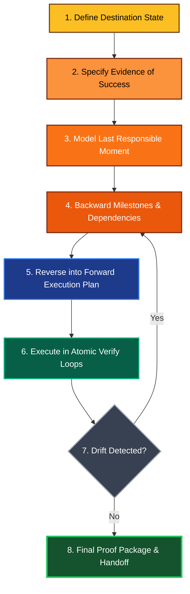

# Reverse Reasoning Methodology (RRM) v2

**Purpose:** Upgrade RRM for current high-capability agents that can plan, execute tools, verify outcomes, and adapt under uncertainty.

**Core idea remains unchanged:** reason from the desired end state backward to the present.

## Why v2

The original RRM is strong for backward planning. v2 adds what modern agents need in practice:

1. **Operational verification loops** (not just planning)
2. **Uncertainty handling** (assumptions, confidence, clarifying thresholds)
3. **Tool-aware execution design** (read/search/edit/test cycles)
4. **Quality and safety gates** (proof before claims)
5. **Adaptive replanning** when reality diverges from plan

---

## RRM v2 — 8-Step Protocol



### Step 1) Define Destination State

Describe the **end state** as observable outcomes, not intent.

- Good: "`POST /login` blocks the 6th request in 15 minutes and returns 429 with expected payload."
- Weak: "Add rate limiting."

### Step 2) Specify Evidence of Success

Declare proof artifacts **before** doing work.

- Primary proof (direct test or run)
- Secondary proof (independent cross-check)
- Side-effect proof (adjacent system still healthy)

If evidence cannot be produced, destination is underspecified.

### Step 3) Model the Last Responsible Moment

Identify what must be true immediately before completion.

- Final state dependencies
- Required files/components in place
- Required runtime/build state

This creates a realistic "last mile" rather than an idealized one.

### Step 4) Backward Milestones & Dependencies

Walk backward through milestones and constraints.

For each milestone, capture:

- Preconditions
- Blocking dependencies
- Failure modes
- Fastest observable check

### Step 5) Reverse into Forward Execution Plan

Flip backward chain into action sequence.

Execution plan rules:

1. Each step must be **atomic** (one meaningful change)
2. Each step must include a **verification action**
3. No step may rely on an unverified assumption

### Step 6) Execute in Atomic Verify Loops

Modern agents should not "plan once, execute blindly."

Use this loop per step:

1. Read context (fresh)
2. Execute one atomic change
3. Verify immediately
4. Record result and confidence
5. Continue or replan

### Step 7) Detect Drift and Replan

Drift means reality differs from planned assumptions.

Trigger replan when:

- A verification check fails
- New constraints appear (API, runtime, policy)
- Side effects exceed expected blast radius

Replan only the necessary suffix of steps; keep validated work intact.

### Step 8) Final Proof Package & Handoff

Completion requires more than "it works locally."

Minimum handoff:

- What changed
- Proof outputs
- Known limitations
- Follow-up recommendations

---

## Decision Discipline for High-Capability Agents

### Assumption Register (Mandatory)

Track assumptions explicitly during execution:

- `A1`: assumption statement
- Confidence: `low | medium | high`
- Validation method
- Status: `pending | validated | invalidated`

If a low-confidence assumption blocks correctness, resolve it before continuing.

### Clarification Threshold (Smart Autonomy)

Autonomy is default, but not reckless.

- **Do not ask** when choice is reversible and low risk.
- **Do ask** when choice is irreversible, high-impact, or changes user intent.

This replaces rigid "never ask" behavior with risk-aware intelligence.

### Confidence-Gated Language

Report outcomes according to evidence strength:

- "Verified" = direct evidence exists
- "Likely" = partial evidence
- "Unverified" = not yet tested

No absolute claims without proof.

---

## Tool-Aware Execution Pattern (Recommended)

Use tools in this order for most coding tasks:

1. **Discover:** semantic search / grep / file listing
2. **Read:** targeted file reads with sufficient context
3. **Plan:** backward milestones → forward atomic steps
4. **Edit:** minimal change set
5. **Validate:** compile/test/error scan
6. **Audit:** side effects and dependency ripple check
7. **Report:** concise, evidence-first handoff

---

## Quality Gates (RRM v2)

All gates must pass before completion:

1. **Destination Clarity Gate** — end state is testable
2. **Evidence Gate** — at least one primary proof exists
3. **Atomicity Gate** — each change was verified before next
4. **Drift Gate** — replanning occurred when assumptions broke
5. **Honesty Gate** — no claims beyond evidence

---

## Upgraded Example — Rate Limiting Login API

### Backward Plan

**Destination:** 6th login attempt within 15 minutes returns 429 with expected schema.

**Evidence:**

- Primary: scripted 6-attempt test
- Secondary: integration test or log confirmation
- Side effect: other auth routes unaffected

**Last mile prerequisites:**

- Middleware wired to correct route
- Config values loaded
- Error response schema matches API contract

**Backward milestones:**

1. Route has limiter middleware
2. Limiter config defined
3. Dependency imported/installed
4. Existing auth behavior baseline captured

### Forward Execution (Atomic)

1. Capture baseline auth behavior (verify)
2. Add limiter dependency/import (verify compile)
3. Add limiter config (verify unit behavior)
4. Attach middleware to login route (verify 6-attempt behavior)
5. Run side-effect checks on adjacent auth endpoints (verify)
6. Produce proof summary with outputs and limitations

---

## Drop-In Prompt Template for Agents

Use this when assigning work to any advanced agent:

```markdown
Apply RRM v2.

1) State destination in testable terms.
2) Define required evidence (primary, secondary, side-effect).
3) Plan backward from last responsible moment.
4) Convert to forward atomic steps with per-step verification.
5) Execute and replan on drift.
6) Report only evidence-backed conclusions with confidence labels.

Output format:
- Destination
- Evidence Plan
- Backward Milestones
- Forward Atomic Steps
- Verification Results
- Assumptions Register
- Final Confidence Statement
```

---

## Migration Notes from Original RRM

Keep from v1:

- Backward-first reasoning
- Last-mile emphasis
- Forward journey map

Replace in v2:

- "Never ask questions" → **risk-aware clarification threshold**
- Single-pass planning → **continuous verify/replan loop**
- Outcome statements → **evidence-calibrated claims**

Result: RRM remains simple, but now matches the real operating strengths of modern super-capable agents.
